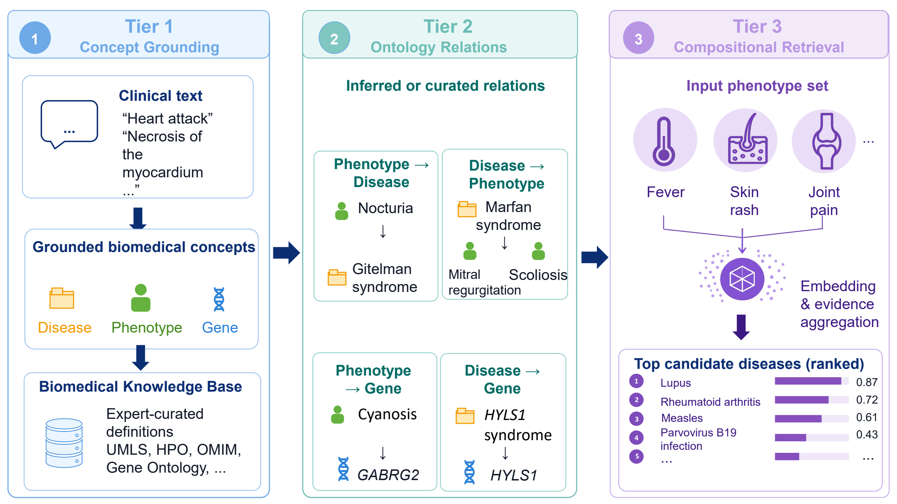

# OntologyBench

[](https://github.com/cindyzhangxy/OntologyBench/actions/workflows/ci.yml)
[](https://www.python.org/downloads/release/python-3110/)
[](LICENSE)
[](paper/OntologyBench.pdf)

**Can dense retrieval satisfy structured biomedical constraints?**

OntologyBench is a tiered benchmark for evaluating whether text retrievers recover ontology-grounded biomedical knowledge across Tier 1 **Concept Grounding**, Tier 2 **Relational Retrieval**, and Tier 3 **Compositional Retrieval**. The release follows the lightweight evaluator-and-results pattern popularized by [MTEB](https://github.com/embeddings-benchmark/mteb): tasks ship with a small Python API and CLI, while paper aggregates remain inspectable data files.

> **Paper:** [OntologyBench: Can Dense Retrieval Satisfy Structured Biomedical Constraints?](paper/OntologyBench.pdf)  
> Xiao Yu Cindy Zhang, Wyeth W. Wasserman, and Jian Zhu (2026)



The main-text tier names above are canonical release metadata. The paper's overview figure uses the synonymous label “Ontology Relations” for Tier 2. Task codes such as `1B-R` and `1C-R` are preserved paper identifiers; both belong to Tier 2.

## What is released

- The exact checksummed eight-task paper split: 8,699 documents and 36,285 queries/qrels.
- A common evaluator for BM25, sentence-transformer, OpenAI embedding, and PyLate backends.
- MTEB-style Python loading for custom retrievers.
- Compact paper aggregates with per-source SHA-256 provenance.
- The canonical Appendix F candidate-scoring prompt and a resumable OpenAI runner.
- Archival data-construction scripts for transparency.

Checkpoints and trainer states are not distributed. Raw rankings, generation traces, private/HPC launchers, and mutable experiment state are also intentionally excluded; they are not required to evaluate a model on the released split.

## Install

```bash
cd EMNLP_ontologybench
python -m pip install -e .
```

Optional backends are installed only when needed:

```bash
python -m pip install -e ".[dense]"   # sentence-transformers
python -m pip install -e ".[openai]"  # OpenAI API
python -m pip install -e ".[rerank]"  # PyLate / ColBERT
```

## Quick start

List tasks and run the dependency-light BM25 baseline:

```bash
ontologybench-evaluate --list-tasks
ontologybench-evaluate \
  --backend bm25 \
  --tasks 1A-R_gene_document_retrieval \
  --no-wandb \
  --no-save
```

Evaluate any compatible retriever in Python:

```python
from ontologybench import OntologyBenchBenchmark
from ontologybench.evaluation.backends import BM25Backend

benchmark = OntologyBenchBenchmark(tasks=["1A-R_gene_document_retrieval"])
scores = benchmark.evaluate(BM25Backend(), k_values=(1, 5, 10))
print(scores)
```

A custom retriever needs only:

```python
def run(queries, docs, top_k):
    # Return {query_id: [ranked_doc_id, ...]}.
    ...

scores = OntologyBenchBenchmark().evaluate(run)
```

## Tasks

| Task | Tier | Query → document | Queries | Documents | Mean positives |
| --- | --- | --- | ---: | ---: | ---: |
| `1A-R_gene_document_retrieval` | 1 — Concept Grounding | gene alias → gene document | 431 | 431 | 1.00 |
| `1A-R_hpo_definition_retrieval` | 1 — Concept Grounding | phenotype alias → HPO definition | 4,581 | 1,701 | 1.00 |
| `1A-R_mondo_definition_retrieval` | 1 — Concept Grounding | disease alias → MONDO definition | 9,205 | 1,252 | 1.00 |
| `1B-R_disorder_to_phenotype` | 2 — Relational Retrieval | disease definition → HPO definition | 6,291 | 1,710 | 5.63 |
| `1C-R_phenotype_to_disorder` | 2 — Relational Retrieval | phenotype definition → MONDO definition | 5,229 | 1,372 | 6.57 |
| `2A-R_phenotype_to_gene` | 2 — Relational Retrieval | phenotype definition → gene document | 1,507 | 447 | 1.00 |
| `2B-R_disease_to_gene` | 2 — Relational Retrieval | disease definition → gene document | 6,504 | 493 | 5.31 |
| `3A-multi_phenotype_to_disorder` | 3 — Compositional Retrieval | phenotype triplet → MONDO definition | 2,537 | 1,293 | 2.26 |

Each task directory contains `queries.jsonl`, `docs.jsonl`, and `qrels.jsonl`. Relevance is binary; the evaluator reports nDCG, MRR, and Hit/Recall at 1, 5, and 10.

## Paper results

The main text-retrieval result is nDCG@10. Here `†` denotes Tier-1-only supervision and `‡` denotes unified supervision across all tiers.

| Model | Gene | HPO | MONDO | D→P | P→D | P→G | D→G | Multi-P→D |
| --- | ---: | ---: | ---: | ---: | ---: | ---: | ---: | ---: |
| BM25 | 0.087 | 0.381 | 0.275 | 0.070 | 0.103 | 0.071 | 0.054 | 0.107 |
| MiniLM-L6-v2 | 0.263 | 0.629 | 0.314 | 0.106 | 0.153 | 0.109 | 0.058 | 0.123 |
| MedEmbed-0.1B | 0.440 | 0.738 | 0.454 | 0.130 | 0.169 | 0.134 | 0.068 | 0.143 |
| SapBERT-0.1B | 0.670 | 0.818 | 0.476 | 0.088 | 0.159 | 0.113 | 0.069 | 0.131 |
| BioLORD-0.1B | 0.290 | 0.807 | 0.426 | 0.091 | 0.178 | 0.105 | 0.058 | 0.151 |
| BioLORD-0.1B† | 0.513 | 0.869 | 0.562 | 0.112 | 0.175 | 0.091 | 0.048 | 0.171 |
| BioLORD-0.1B‡ | 0.455 | 0.668 | 0.532 | 0.160 | 0.166 | 0.191 | 0.089 | 0.244 |
| Qwen3-Embed-0.6B | 0.325 | 0.605 | 0.247 | 0.089 | 0.151 | 0.106 | 0.063 | 0.109 |
| Qwen3-Embed-0.6B† | 0.615 | 0.864 | 0.538 | 0.112 | 0.158 | 0.076 | 0.045 | 0.158 |
| Qwen3-Embed-0.6B‡ | 0.499 | 0.572 | 0.488 | 0.184 | 0.283 | 0.269 | 0.110 | 0.313 |
| Qwen3-Embed-4B | 0.526 | 0.616 | 0.330 | 0.119 | 0.188 | 0.129 | 0.073 | 0.080 |
| OpenAI text-embedding-3-large | 0.747 | 0.860 | 0.516 | 0.116 | 0.195 | 0.136 | 0.069 | 0.169 |

Full-precision nDCG/MRR/Hit values live in [`results/paper/retrieval_results.csv`](results/paper/retrieval_results.csv). Ontology-aware diagnostic references and the reranking/LLM candidate-scoring table are documented in [`results/paper/README.md`](results/paper/README.md). See results/paper/README.md for provenance information and documented discrepancies between selected archived outputs and the corresponding published results.

## Appendix F scoring prompt

The release prompt is implemented once in `ontologybench.generative.scoring`; its semantic template SHA-256 is:

```text
11b242f710f212f0e37e21db54c704c32f7153f01c0991f3a939151438fce08a
```

To score a prepared JSONL file, each row must contain a `query_id`, an explicit `phenotypes` string list, and a `candidates` list of objects with `doc_id` and `text`:

```json
{"query_id":"q1","phenotypes":["Fever","Skin rash","Joint pain"],"candidates":[{"doc_id":"d1","text":"Candidate disorder description."}]}
```

```bash
python src/scripts/run_openai_scoring.py \
  --input candidates.jsonl \
  --output scores.jsonl \
  --model <OPENAI_MODEL_NAME>
```

The runner validates strict `{"score": INTEGER}` responses, appends resumable JSONL, and never embeds credentials. This is the canonical prompt for the current release.  

## Hugging Face training and test release

The upload-ready dataset is one `DatasetDict` with `train` and `test` splits. Rows are positive query-target pairs with `task_name`, `tier_id`, and `tier_name` columns; negatives are intentionally left to in-batch or mining strategies.

Generate the deterministic release from the full task artifacts:

```bash
python src/scripts/create_splits.py \
  --tasks-root /path/to/OntologyBench/ontologybench/data/tasks \
  --output-dir hf_dataset
```

The command enforces the paper's expected per-task query counts and average positives, writes compressed JSONL shards plus a Hub-compatible dataset card, and records target assignments and SHA-256 checksums. The generated `hf_dataset/` folder is ignored by this software repository because it is a separate Hugging Face upload payload.

After reviewing the generated summary, upload it with the official Hub client:

```python
from huggingface_hub import HfApi

HfApi().upload_folder(
    folder_path="hf_dataset",
    repo_id="cxyzhang/OntologyBench",
    repo_type="dataset",
)
```

No Hugging Face credentials are stored by OntologyBench. Install the optional client and loader with `python -m pip install -e ".[huggingface]"`.

## Integrity and reproducibility

```bash
ontologybench-verify
ontologybench-validate
python -m unittest discover -s tests -v
```

The validator reports known non-fatal warnings for duplicate surface forms and one cross-evaluation overlap. See [`PROVENANCE.md`](PROVENANCE.md) for upstream versions and result lineage, and [`DATA_LICENSE.md`](DATA_LICENSE.md) for data terms.

The scripts under src/scripts/ and src/pipeline.py document data construction. Because upstream ontology resources may change, the checksummed task artifacts constitute the reproducible benchmark release.

## Repository layout

```text
src/ontologybench/              evaluator, registry, metrics, packaged tasks
src/scripts/                    archival preprocessing and scoring entry points
results/paper/                  compact paper aggregates and provenance manifest
assets/                         paper overview figure
paper/                          manuscript PDF
tests/                          metrics, prompt, integrity, and release contracts
```

## License and citation

Code is MIT-licensed. The released task artifacts are CC BY 4.0 and retain upstream attribution obligations.

```bibtex
@inproceedings{zhang2026ontologybench,
  title     = {{OntologyBench}: Can Dense Retrieval Satisfy Structured Biomedical Constraints?},
  author    = {Zhang, Xiao Yu Cindy and Wasserman, Wyeth W. and Zhu, Jian},
  booktitle = {Proceedings of the 2026 Conference on Empirical Methods in Natural Language Processing},
  month     = oct,
  year      = {2026},
  address   = {Budapest, Hungary},
  publisher = {Association for Computational Linguistics},
  note      = {To appear}
}
```
